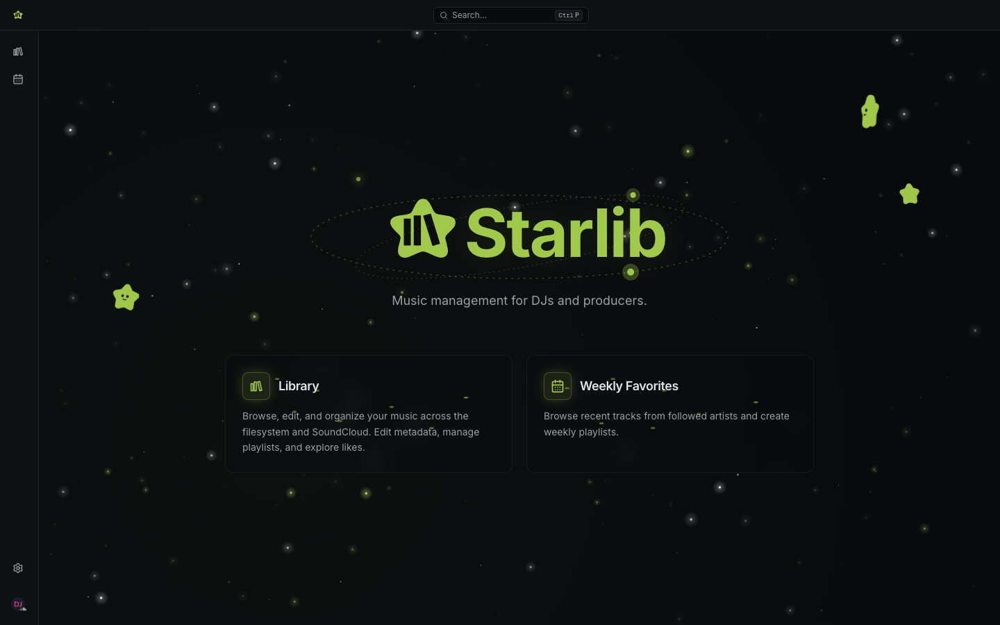
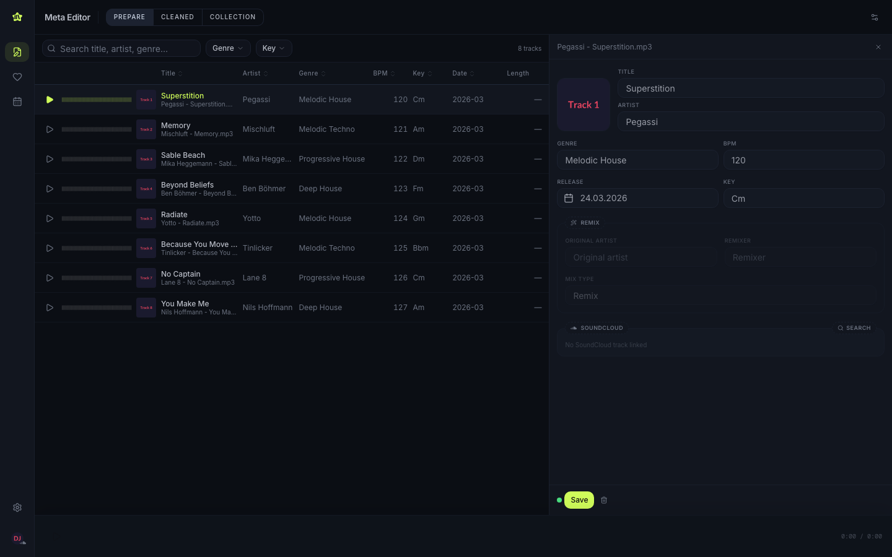
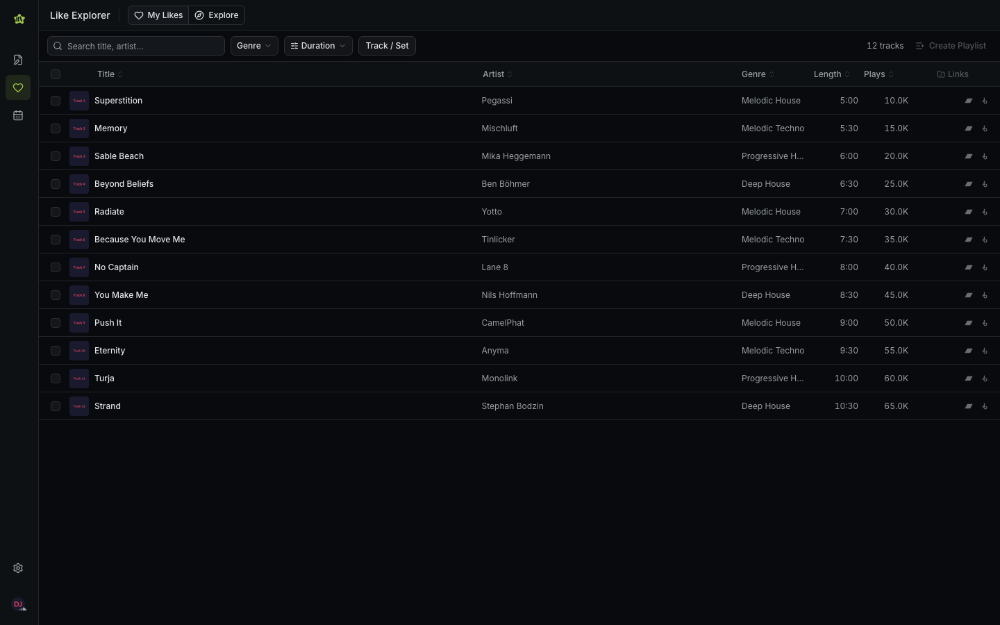
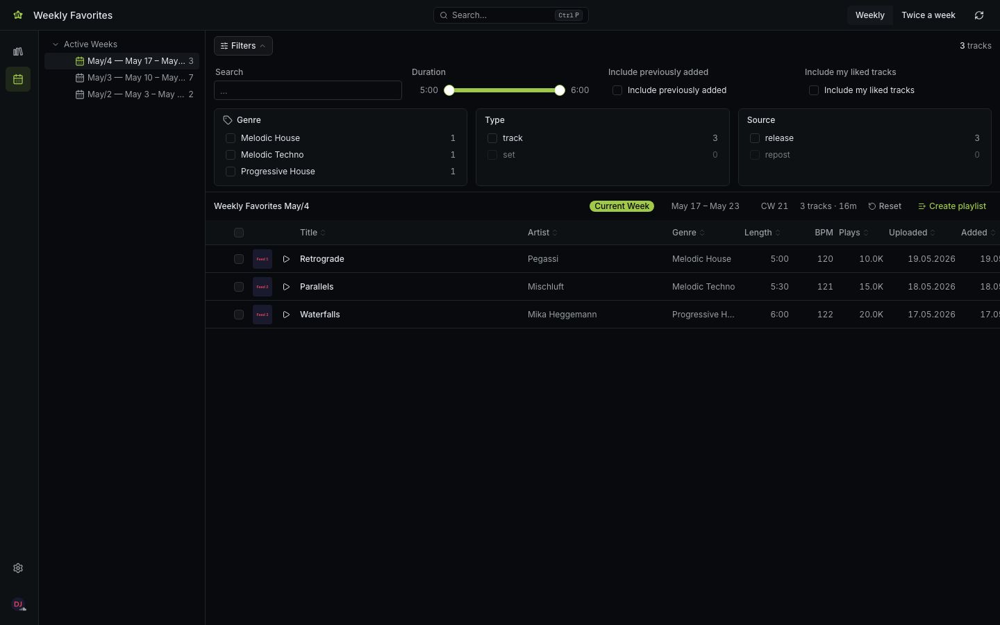

<div align="center">

<h1>
  <picture>
    <source media="(prefers-color-scheme: dark)" srcset="frontend/public/starlib-logo-white.svg">
    <source media="(prefers-color-scheme: light)" srcset="frontend/public/starlib-logo.svg">
    
  </picture>
  Starlib
</h1>

**A DJ library management app for SoundCloud.**\
Organise your tracks, edit metadata, and discover new music — all from a single interface.

[](https://github.com/fstermann/starlib/releases/latest)
[](https://fstermann.github.io/starlib/)



[**Download**](https://github.com/fstermann/starlib/releases/latest) · [**Documentation**](https://fstermann.github.io/starlib/) · [**Report a Bug**](https://github.com/fstermann/starlib/issues/new)

</div>

---

## Features

### Meta Editor

Edit ID3/AIFF metadata on local audio files. Search SoundCloud to auto-fill title, artist, BPM, key, genre, and artwork.



### Like Explorer

Browse your liked tracks and discover new music from other users. Filter by genre, duration, and collection status. Create playlists from your selections.



### Weekly Favorites

See new tracks from artists you follow, grouped by calendar week. Generate playlists automatically and keep track of what you've already seen.



## Install

Download the latest release for your Mac:

| Mac | Download |
|-----|----------|
| Apple Silicon (M1/M2/M3/M4) | [`aarch64.dmg`](https://github.com/fstermann/starlib/releases/latest) |
| Intel | [`x64.dmg`](https://github.com/fstermann/starlib/releases/latest) |

Then remove the quarantine flag and launch:

```bash
xattr -cr /Applications/Starlib.app
```

> See the [Installation guide](https://fstermann.github.io/starlib/guide/installation/) for detailed instructions.

## Development

| Component | Stack | Directory |
|-----------|-------|-----------|
| Backend API | FastAPI · Python | `backend/` |
| Frontend | Next.js · React · TypeScript | `frontend/` |
| Desktop app | Tauri v2 · Rust | `desktop/` |

```bash
# Terminal 1 – Backend
uv run python -m backend.main   # → http://localhost:8000

# Terminal 2 – Frontend
cd frontend && npm run dev       # → http://localhost:3000
```

## Documentation

Full documentation is available at [fstermann.github.io/starlib](https://fstermann.github.io/starlib/):

- [**User Guide**](https://fstermann.github.io/starlib/guide/) — Installation, setup, and features
- [**Technical Docs**](https://fstermann.github.io/starlib/technical/) — Architecture, APIs, and contributing

To serve the docs locally:

```bash
uv run zensical serve   # → http://localhost:8200
```
