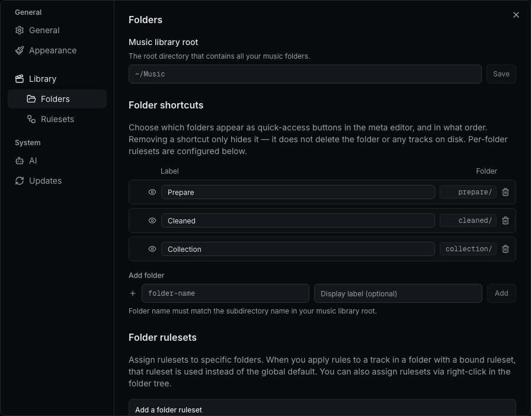
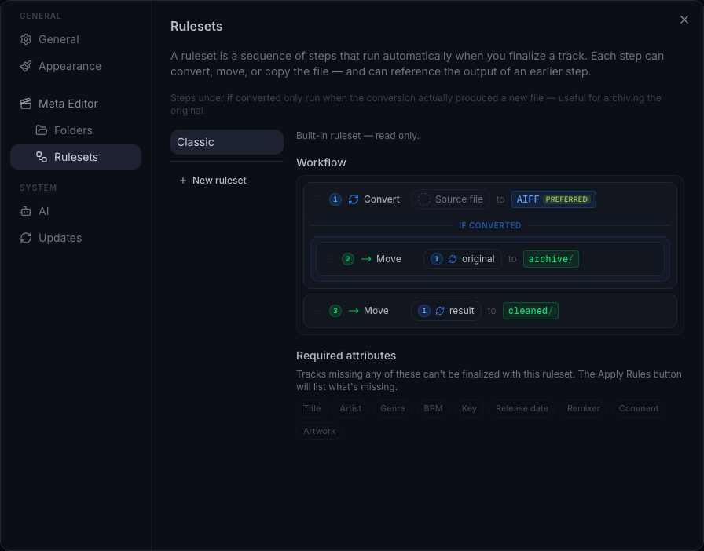

# Features

Starlib has three main tools, accessible from the sidebar or the home screen.

<figure markdown="span" style="text-align: center;">
  { width="90%" }
</figure>

## :material-tag-edit: Meta Editor

The metadata editor lets you edit ID3/AIFF tags on your local audio files and enrich them with data from SoundCloud.

- Browse files in your music folder
- Search SoundCloud to find matching tracks
- Edit title, artist, BPM, key, genre, and artwork
- Detect and parse remix information automatically
- Apply metadata from SoundCloud to local files

<figure markdown="span" style="text-align: center;">
  { width="90%" }
</figure>

### Workflow

1. Select a file from the file browser on the left.
2. Search SoundCloud for the track (or let Starlib match it automatically).
3. Review and edit the metadata fields.
4. Click **Save** to write the tags to the file.
5. When the track is ready (all required fields filled), click **Apply Rules** to finalize.

### Apply Rules

Once a track has all required metadata, the **Apply Rules** button appears. Clicking it runs the active ruleset — a sequence of steps that convert, move, or copy the file automatically.

Click the :material-information-outline: icon next to the button to preview which steps will run before confirming.

### Settings

The Meta Editor is configured through **Settings** (gear icon in the sidebar). The settings dialog has three relevant sections: **Folders**, **Rulesets**, and **Meta Editor**.

#### Music Library Root

Under **Settings > Folders**, set the root directory that contains all your music folders. In the desktop app, click the folder icon to open a native file picker.

#### Folder Tabs

Below the root path, configure which folders appear as tabs in the meta editor. Each folder maps to a subdirectory in your music library root.

| Column | Description |
|--------|-------------|
| :material-eye: | Toggle visibility — hidden folders are not shown in the meta editor |
| **Label** | Display name shown in the tab bar |
| **Folder** | Subdirectory name on disk |
| **Ruleset** | Ruleset to use when finalizing from this folder (blank = use the active ruleset) |

!!! note
    Removing a folder tab only hides it from the meta editor — it does not delete the folder or any tracks on disk.

#### Rulesets

Under **Settings > Rulesets**, define how files are processed when you finalize a track. A ruleset is a sequence of steps that run in order.

Each step can:

| Type | What it does |
|------|-------------|
| **Convert** | Convert the file to a target format (AIFF or MP3) |
| **Move** | Move the file to a folder |
| **Copy** | Copy the file to a folder (leaving the original in place) |

Steps can reference the output of earlier steps. For example, a move step can target the result of a convert step — so it moves whichever file the convert produced (the converted file if conversion happened, or the original if it was already in the target format).

##### Conditional steps ("if converted")

Steps nested under **if converted** only run when the convert step actually produced a new file. This is useful for archiving the original when a conversion happens, without touching it otherwise.

##### The Classic ruleset

The built-in **Classic** ruleset demonstrates the typical DJ workflow:

1. :material-sync: **Convert** the source file to your preferred format (e.g. AIFF)
2. :material-arrow-right: **Archive** the original to `archive/` — only if conversion happened
3. :material-arrow-right: **Move** the result to `cleaned/`

If the file is already in the target format, step 1 is a no-op, step 2 is skipped (no conversion happened), and step 3 moves the original directly to `cleaned/`.

#### Preferred Output Format

Under **Settings > Meta Editor**, choose the default format used by convert rules set to "preferred". This can be overridden per-rule.

## :material-heart: Like Explorer

Browse and explore liked tracks, both yours and other users'.

- View all your liked tracks with filtering and sorting
- Search for other SoundCloud users and browse their likes
- Filter by genre, duration, and collection status
- Create playlists from selected tracks
- See which tracks are already in your collection

<figure markdown="span" style="text-align: center;">
  { width="90%" }
</figure>

### Tabs

| Tab | Description |
|-----|-------------|
| **My Likes** | Your liked tracks on SoundCloud |
| **Explore** | Search other users and browse their likes, with an option to exclude tracks you've already liked |

## :material-calendar-week: Weekly Favorites

Discover new tracks from artists you follow, grouped by week.

- See recent tracks from followed artists, grouped by calendar week
- Switch between weekly and bi-weekly grouping
- Filter by genre, duration, and search terms
- Exclude tracks from playlists you've already seen
- Exclude tracks you've already liked
- Generate playlists from any week group

<figure markdown="span" style="text-align: center;">
  { width="90%" }
</figure>
