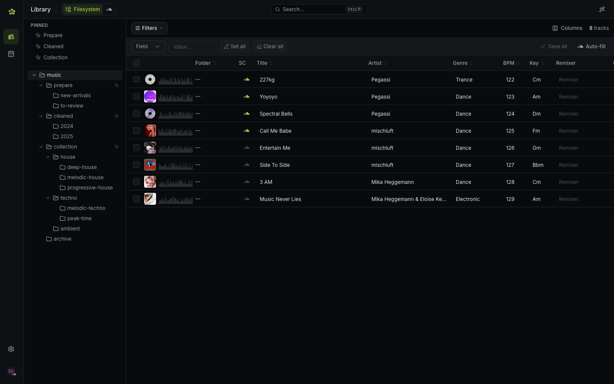
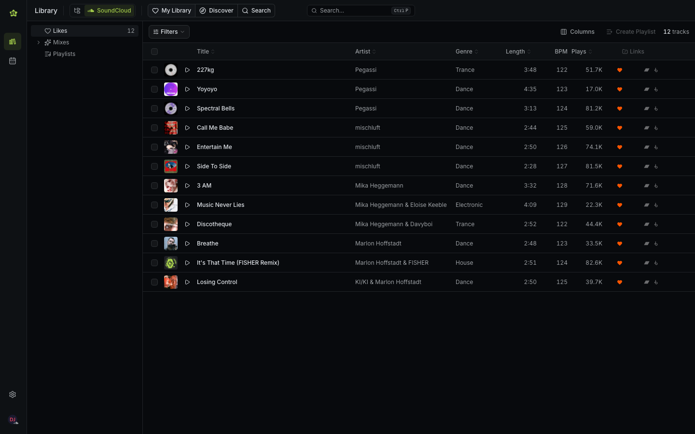

# Features

Starlib has two main tools, accessible from the sidebar or the home screen.

<figure markdown="span" style="text-align: center;">
  { width="90%" }
</figure>

## :material-library: Library

The Library is one view for your whole music collection, with two **sources** you switch between at the top of the page:

- **Filesystem** — local audio files, with metadata editing
- **SoundCloud** — your likes and playlists, plus Discover for browsing other users

The source switcher is a segmented pill in the top bar. The active source shows its icon + label; the inactive one appears as an icon and expands to reveal its label on hover.

### :material-folder-open: Filesystem source

Edit ID3/AIFF tags on your local audio files and enrich them with data from SoundCloud.

- Browse files in your music folder
- Search SoundCloud to find matching tracks
- Edit title, artist, BPM, key, genre, and artwork
- Detect and parse remix information automatically
- Apply metadata from SoundCloud to local files

<figure markdown="span" style="text-align: center;">
  { width="90%" }
</figure>

#### Workflow

1. Select a folder from the **folder tree** on the left, or a file from the table.
2. Search SoundCloud for the track (or let Starlib match it automatically).
3. Review and edit the metadata fields.
4. Click **Save** to write the tags to the file.
5. When the track is ready (all required fields filled), click **Apply Rules** to run the active ruleset.

#### Folder tree

The left pane shows a tree of every folder that contains indexed tracks. Each folder displays a recursive track count on the right edge. A :material-sitemap: icon appears next to folders that have a ruleset bound to them; the icon is stronger when the binding is recursive (applies to sub-folders) and muted when inherited from an ancestor.

**Right-click a folder** to:

- **Pin as shortcut / Remove shortcut** — see [Pinned shortcuts](#pinned-shortcuts) below
- **Ruleset** submenu — assign, change, or clear the binding; toggle **Apply to sub-folders**

#### Pinned shortcuts

A **Pinned** section above the folder tree holds quick-access links to folders you use often. Pin any folder (at any depth, not just top-level) via right-click → **Pin as shortcut**.

Each pinned row supports:

- **Drag handle** (appears on hover) — reorder shortcuts by dragging
- **Label** — click to jump to the folder; double-click (or pencil icon) to rename in place; `Enter` commits, `Esc` cancels
- **Tooltip** — hover a shortcut to see the path it points to, relative to your music library root
- **Unpin** (:material-pin-off:) — removes the shortcut (the folder itself is untouched)

Tree nodes that are pinned show a small :material-pin: indicator in the tree below.

#### Batch edit

The table supports bulk operations across many tracks:

- **Save all** — writes every pending change at once. A confirmation dialog appears whenever more than one file is affected.
- **Apply rules** — runs the active ruleset against all selected tracks (or the full table when nothing is selected). The button shows a count of *eligible* tracks and is disabled when none qualify. Tracks that don't meet the ruleset's **required attributes** are automatically skipped, and the confirmation dialog reports how many were left out.

Per-row **Save** (:material-check:) and **Apply rules** (:material-sitemap:) buttons live in a pinned action column that floats over the right edge of the table with a frosted-glass background.

#### Smart suggestions

When you open the editor on a track (with or without a SoundCloud track linked), Starlib computes ranked **suggestions** for every metadata field. Suggestions are *proposals* — nothing is written to a field without an explicit click.

Two distinct controls live in the per-field toolbar:

- **Accept suggestion** (:material-auto-fix: wand icon, brand accent) — applies the engine's top-ranked candidate. Hover for the value and source. When several candidates exist (e.g. metadata artist vs. uploader vs. filename), a chevron expands a popover listing every alternative, each annotated with its source label and confidence bar.
- **Copy from SoundCloud** (SoundCloud logo) — copies the SC field *verbatim* into the local field. Different from Accept: a suggestion may be derived (e.g. the SC title with `(Extended Mix)` stripped); this button always pastes the raw value.

A header-row **Accept N suggestions** button applies every top-ranked suggestion in one click. It only appears when there's something to apply, and its tooltip lists the affected fields.

Sources the engine pulls from today: the SC track's `metadata_artist`, uploader name, dash-prefix and parens-content of the title, genre or first tag, release date, BPM and key signature when SC exposes them, plus the local filename's parsed artist/title/remixer/mix. Multiple distinct artists across sources surface as a comma-joined "combined" candidate (e.g. `Foo, Bar`); multi-artist strings like `A & B feat. C` are also offered in normalised `A, B, C` form. Suggestions equal to the current field value are hidden.

#### Apply Rules

Once a track has all required metadata, the **Apply Rules** button appears. Clicking it runs the active ruleset — a sequence of steps that convert, move, or copy the file automatically.

Click the :material-information-outline: icon next to the button to preview which steps will run before confirming.

##### Required attributes

A ruleset can declare which track attributes must be populated before it will run — these are the **required attributes**. Apply Rules is gated when any of them are missing; hovering the disabled button lists exactly what's missing.

The built-in **Classic** ruleset requires **title, artist, genre, release date, and artwork**. Custom rulesets can declare their own set (or none, to disable the gate entirely).

### :material-soundcloud: SoundCloud source

Browse your SoundCloud library and discover music from other users. Switch the source tab to **SoundCloud** and use the sub-tabs in the top bar:

| Sub-tab | Description |
|---------|-------------|
| **My Library** | Your likes, playlists, and **Mixes** (Weekly Wave, Daily Drops, Your Mix 1–10) on SoundCloud |
| **Discover** | Search for another user and browse their library, with an option to exclude tracks you've already liked |
| **Search** | Free-text search across all of SoundCloud — find any track, not just ones in your (or another user's) likes. Paste a SoundCloud track URL to resolve it directly. |

All three sub-tabs share the same filter/table UX: filter by genre, duration, track vs. DJ set, and collection status; exclude tracks you've already liked on SoundCloud; see at a glance which tracks are already in your local collection; select tracks to build a playlist and publish it to SoundCloud.

The **Mixes** section always shows on *My Library* for the desktop app, but it only populates after the login window has captured a SoundCloud session cookie — personalized-playlist endpoints aren't exposed on SoundCloud's public API. If the cookie is missing or expired, the Mixes pane shows a **Reconnect SoundCloud** button that restarts the login flow; the cookie is harvested on the way out and stored in `config.env` as `OAUTH_TOKEN`. See [`authentication.md`](../technical/authentication.md) for the full flow.

<figure markdown="span" style="text-align: center;">
  { width="90%" }
</figure>

### Settings

The Library is configured through **Settings** (gear icon in the sidebar). Relevant sections: **Folders**, **Rulesets**, and **Library**.

#### Music Library Root

Under **Settings > Folders**, set the root directory that contains all your music folders. In the desktop app, click the folder icon to open a native file picker.

#### Folder shortcuts

The **Folders** section in Settings lists every pinned shortcut alongside the built-in ones (Prepare / Collection / Cleaned). You can also pin shortcuts directly from the tree context menu (see [Pinned shortcuts](#pinned-shortcuts)).

| Column | Description |
|--------|-------------|
| :material-eye: | Toggle visibility — hidden shortcuts don't appear in the tree panel |
| **Label** | Display name shown in the tree panel Pinned section |
| **Folder** | Either a subdirectory name relative to the music root, or an absolute path for shortcuts pinned from anywhere in the tree |

Per-folder rulesets are configured in the **Folder rulesets** section below, or via right-click in the folder tree.

!!! note
    Removing a shortcut only hides it from the tree panel — it does not delete the folder or any tracks on disk.

#### Folder rulesets

The **Folder rulesets** panel lists every folder that has a ruleset bound to it. Each row shows the folder path, the bound ruleset (with a :material-sitemap: icon mirroring the tree view — thicker stroke + **R** badge when the binding is recursive), and a trash button to remove the binding.

Add a new binding from this panel, or directly from the folder tree (right-click → **Ruleset**). Recursive bindings are inherited by any descendant folder that doesn't have its own binding.

#### Rulesets

Under **Settings > Rulesets**, define how files are processed when you apply rules to a track. A ruleset is a sequence of steps that run in order.

Each step can:

| Type | What it does |
|------|-------------|
| **Convert** | Convert the file to a target format (AIFF or MP3) |
| **Move** | Move the file to a folder |
| **Copy** | Copy the file to a folder (leaving the original in place) |

Steps can reference the output of earlier steps. For example, a move step can target the result of a convert step — so it moves whichever file the convert produced (the converted file if conversion happened, or the original if it was already in the target format).

##### Conditional steps ("if converted")

Steps nested under **if converted** only run when the convert step actually produced a new file. This is useful for archiving the original when a conversion happens, without touching it otherwise.

##### The Classic ruleset

The built-in **Classic** ruleset demonstrates the typical DJ workflow:

1. :material-sync: **Convert** the source file to your preferred format (e.g. AIFF)
2. :material-arrow-right: **Archive** the original to `archive/` — only if conversion happened
3. :material-arrow-right: **Move** the result to `cleaned/`

If the file is already in the target format, step 1 is a no-op, step 2 is skipped (no conversion happened), and step 3 moves the original directly to `cleaned/`.

Classic requires **title, artist, genre, release date, and artwork** before it can run — Apply Rules stays disabled on any track missing one of these.

#### Preferred Output Format

Under **Settings > Library**, choose the default format used by convert rules set to "preferred". This can be overridden per-rule.

#### Ollama (LLM Integration)

Under **Settings > Ollama**, connect a local Ollama instance for LLM-powered features. See the [Ollama setup guide](ollama.md) for installation and configuration.

## :material-keyboard: Command palette

Press ++cmd+p++ (macOS) or ++ctrl+p++ (Windows/Linux) from anywhere to open the command palette — a Spotlight-style overlay for fast navigation, search, and actions. There's also a **Search…** bar in the middle of the top app bar you can click instead.

- **Go to** any page or sub-tab (Library Filesystem, Library SoundCloud Search/Discover/My Library, Weekly Favorites…)
- **Folders** — jump directly to any pinned folder shortcut
- **Local Library** — search your on-disk collection by title or artist
- **SoundCloud Tracks** — search all of SoundCloud by title/artist, or paste a track URL. Selecting a result opens the Search tab with that track and **starts playback automatically**.
- **SoundCloud Users** — jump straight into a user's library in Discover
- **Actions** — connect/disconnect SoundCloud, toggle the theme, open Settings, reload the current library, create a playlist from selected tracks, and other context-aware commands contributed by the current view

Use ++arrow-up++ / ++arrow-down++ to navigate, ++enter++ to run, ++escape++ to dismiss.

## :material-calendar-week: Weekly Favorites

Discover new tracks from artists you follow, grouped by week.

- See recent tracks from followed artists, grouped by calendar week
- Switch between weekly and bi-weekly grouping
- Filter by genre, duration, and search terms
- Exclude tracks from playlists you've already seen
- Exclude tracks you've already liked
- Generate playlists from any week group

<figure markdown="span" style="text-align: center;">
  { width="90%" }
</figure>
