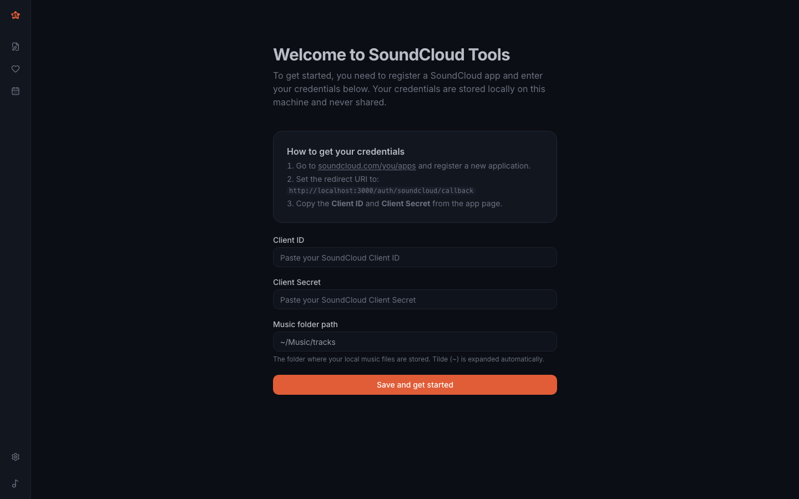
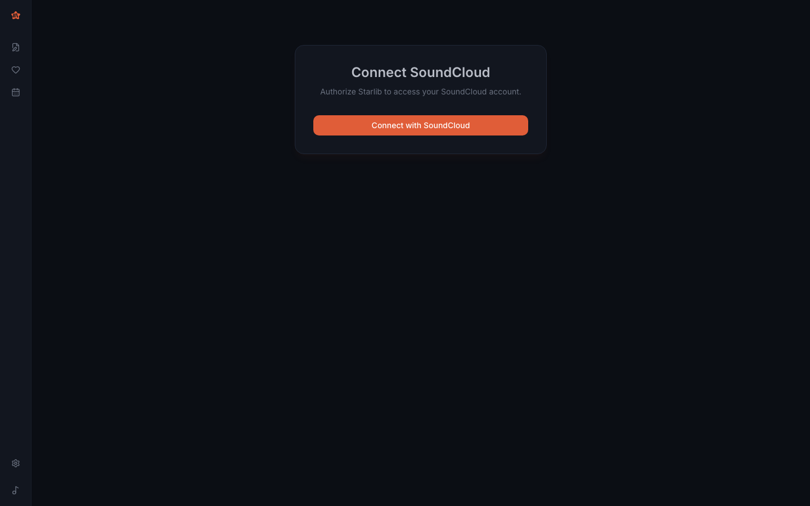

# Setup

When you first launch Starlib, the setup wizard guides you through connecting your SoundCloud account.

## 1. Get SoundCloud API credentials

Starlib needs API credentials to access your SoundCloud data.

1. Go to the [SoundCloud Developer Portal](https://soundcloud.com/you/apps) (log in if prompted).
2. Click **Register a new application**.
3. Give it any name (e.g. "Starlib").
4. Set the **Redirect URI** to:

    ```
    http://localhost:3000/auth/soundcloud/callback
    ```

5. Save the app and copy the **Client ID** and **Client Secret**.


## 2. Enter credentials in Starlib

On the setup screen, enter:

| Field | Value |
|-------|-------|
| **Client ID** | From your SoundCloud app |
| **Client Secret** | From your SoundCloud app |
| **Music folder** | Path to your local music folder (defaults to `~/Music/tracks`) |



Click **Save** to continue.

## 3. Connect your SoundCloud account

After saving your credentials, you'll be taken to the home screen. Click **Connect with SoundCloud** to log in with your SoundCloud account.

SoundCloud will ask you to authorise Starlib. After approval, you'll be redirected back to the app and can start using it.


